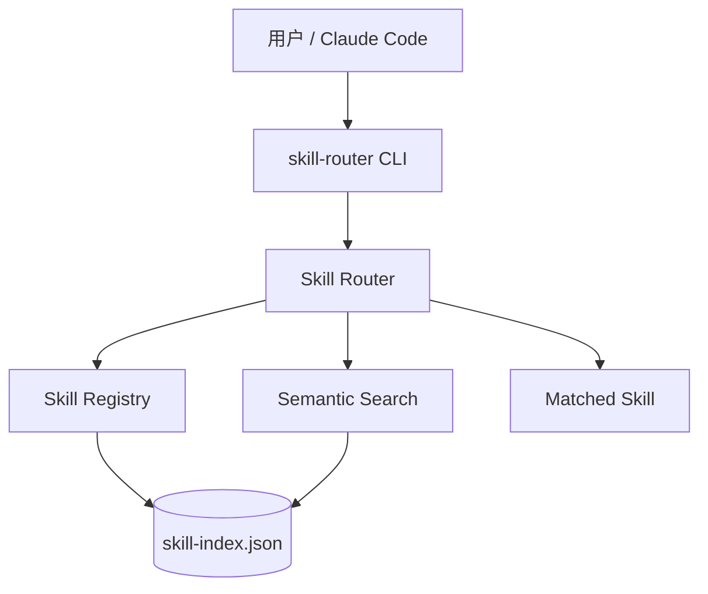

# cc-skill-router

[](https://github.com/maxliven/cc-skill-router/actions/workflows/ci.yml)
[](https://www.python.org/downloads/)
[](LICENSE)
[](https://github.com/astral-sh/ruff)

> 渐进式 Claude Code Skill 路由系统 — 中英文模糊搜索，3 阶段路由策略，270+ Skill 覆盖，零依赖。

**Semantic skill router for Claude Code** — bilingual fuzzy search, 3-stage routing, zero dependencies.

> 🀄 **本项目针对中文使用场景深度优化**：内置 100+ 条中文关键词映射表，支持 CJK bigram 模糊匹配，中文查询无需记忆英文 skill 名。
>
> 🀄 **Optimized for Chinese-language workflows**: 100+ Chinese→English keyword mappings, CJK bigram fuzzy matching. Query in Chinese, find the right English-named skill instantly.

---

[中文](#中文) | [English](#english)

---

## 中文

### 这是什么？

你的 Claude Code 装了 50 个 skill，甚至 200 个。每个 skill 做一件特定的事。但当你说「帮我检查一下这段论证有没有逻辑漏洞」时，该调用哪个？`s4h-logic-check`？`s4h-logic-consistency-check`？还是一般的 `s4h`？

**cc-skill-router** 解决的就是这个问题。它是一个 3 阶段语义路由器：

```
用户请求: "这段论证逻辑有问题吗？"
    │
    ├─ 阶段1: 高频 Skill 直接命中（~25 个常用 skill 秒匹配）
    │     "论证" + "逻辑" + "检查" → s4h-logic-check ✓
    │
    ├─ 阶段2: 域级过滤搜索（thinking/coding/tools/content/persona/runbook/infra）
    │     skill-router search "论证 逻辑 检查" -g thinking
    │
    └─ 阶段3: 全库模糊搜索（无匹配时兜底）
          skill-router search "论证 逻辑 检查" -n 5
```

### 架构



### 安装

```bash
# 1. 安装 CLI 工具（Python ≥ 3.10，零依赖）
pip install git+https://github.com/maxliven/cc-skill-router.git

# 2. 安装 Claude Code skill 定义
skill-router init

# 3. 生成注册表
skill-router scan
```

### 快速开始

```bash
# 搜索 skill（中文）
skill-router search "逻辑检查"
skill-router search "头脑风暴创意发散"
skill-router search "润色文章" -g thinking

# 搜索 skill（English）
skill-router search "brainstorm creative ideas"
skill-router search "debug login error" -g coding

# JSON 输出（给脚本/AI agent 用）
skill-router search "证据审计" -f json

# 浏览所有 skill
skill-router list
skill-router list -g tools
skill-router list --domain writing -f json

# 重新扫描
skill-router scan -d ~/.claude/skills -v
```

### 中文搜索原理

搜索引擎采用 **双语分词 + 加权评分**：

1. **中→英关键词翻译**（最长匹配优先）："润色" → `editing`, `line-editing`, `prose`, `polish`
2. **CJK bigram 模糊匹配**：连续汉字两两成对，即使描述里没有完整词也能匹配
3. **加权评分**：skill 名称命中 +3.0，领域命中 +2.0，描述命中 +1.5

### 为什么针对中文优化？

Claude Code 的 skill 生态以英文为主（skill 名、描述全是英文），但中文用户习惯用中文表达需求。cc-skill-router 在中英文之间架了一座桥：

- 100+ 条中文→英文关键词映射（逻辑、创意、战略、写作、心理...）
- CJK 字符级模糊匹配，短查询也能命中
- 搜索结果同时展示 skill 名（英文）和描述（中英混合），方便确认

### Python API

```python
from skill_router import SkillRouter

# 自动加载 ~/.skill-router/index.json
router = SkillRouter()

# 路由用户请求到最佳 skill
match = router.route("帮我压缩图片")
if match:
    print(match.skill_id)   # "s4h-information-compression"
    print(match.score)      # 8.5

# 搜索 skill（中文或英文）
matches = router.search("头脑风暴创意发散", n=5)
for m in matches:
    print(f"{m.name}: {m.description}")

# 生成/重新生成注册表
router.build(skill_dirs=["~/.claude/skills"])
```

### 自定义

```bash
# 扫描自定义目录
skill-router scan -d /path/to/my/skills -o ./my-index.json

# 使用自定义注册表搜索
skill-router search "query" -r ./my-index.json
```

编辑 `skill_router/search.py` 中的 `CN_KEYWORD_MAP` 添加你领域的中文关键词映射。

---

## English

### What is this?

You've built a library of Claude Code skills. When a user says "audit my argument for logical fallacies," which skill handles that? Scanning a giant skill list by hand is slow. Grep can't understand that "润色" (polish) means `s4h-writing-line-editing`, or that "头脑风暴" (brainstorm) should route to `s4h-creativity-brainstorm`.

**cc-skill-router** routes user requests to the best matching skill using a 3-stage strategy:
1. **Direct match** — ~25 high-frequency skills, instant routing
2. **Domain-filtered search** — narrow by group, then fuzzy match
3. **Full-registry search** — bilingual semantic search across all skills

### Installation

```bash
# 1. Install the CLI (Python ≥ 3.10, zero dependencies)
pip install git+https://github.com/maxliven/cc-skill-router.git

# 2. Install the Claude Code skill definition
skill-router init

# 3. Generate your registry
skill-router scan
```

### Quick Start

```bash
# Search (Chinese or English)
skill-router search "logic check"
skill-router search "brainstorm creative ideas" -n 10
skill-router search "debug" -g coding -f json

# Browse
skill-router list
skill-router list -g tools
skill-router list --domain writing -f json

# Rescan
skill-router scan -d ~/.claude/skills ~/.codex/skills -v
```

### How Chinese Search Works

The engine uses **bilingual tokenization + weighted scoring**:

1. **Chinese→English keyword translation** (longest-match-first): "润色" (polish) → `editing`, `line-editing`, `prose`, `polish`
2. **CJK bigram fuzzy matching**: consecutive character pairs for flexible matching
3. **Weighted scoring**: name match = 3.0, domain match = 2.0, description match = 1.5

### Why Chinese-Optimized?

Claude Code skills are predominantly English-named and English-described, but a significant user base works in Chinese. cc-skill-router bridges this gap with built-in Chinese NLP:

- 100+ Chinese→English keyword mappings covering thinking, writing, strategy, psychology, and more
- CJK character-level fuzzy matching for short queries
- Zero-config: Chinese queries work out of the box

### Python API

```python
from skill_router import SkillRouter

router = SkillRouter()

# Route a request to the best skill
match = router.route("audit my argument for logical fallacies")
if match:
    print(match.skill_id)   # "s4h-logic-check"
    print(match.score)      # 7.5

# Search skills
matches = router.search("brainstorm creative ideas", n=5)
for m in matches:
    print(f"{m.name}: {m.description}")

# Rebuild the registry
router.build(skill_dirs=["~/.claude/skills"])
```

### Customization

```bash
# Custom skill directories
skill-router scan -d /path/to/skills -o ./my-index.json

# Use custom registry
skill-router search "query" -r ./my-index.json
```

Edit `CN_KEYWORD_MAP` in `skill_router/search.py` to add domain-specific Chinese terms.

### Skill Groups

| Group | Description | Examples |
|-------|-------------|---------|
| `thinking` | Analysis, creativity, logic, decision, ethics, strategy, writing, systems | s4h-*, dbs-* |
| `coding` | Code review, debugging, refactoring, architecture | ponytail, code-review |
| `tools` | External tools and utilities | lit-search, ppt-master, notebooklm |
| `content` | Content creation and research | khazix-writer |
| `persona` | Role-play and style simulation | zhangxuefeng-skill |
| `runbook` | Troubleshooting and incident response | dbs-troubleshoot |
| `infra` | System maintenance and configuration | cache-cleanup, storage-analyzer |

## Project Structure

```
cc-skill-router/
├── skill_router/           # Core package
│   ├── __init__.py         # SkillRouter public API
│   ├── cli.py              # CLI (click-free, stdlib argparse)
│   ├── registry.py         # Skill registry + SKILL.md frontmatter parser
│   ├── search.py           # Search engine + CN_KEYWORD_MAP
│   └── skills/             # Bundled skill definitions
├── tests/                  # Test suite
├── .github/workflows/      # CI/CD
├── pyproject.toml
├── README.md
├── CONTRIBUTING.md
└── CHANGELOG.md
```

## Development

```bash
# Clone
git clone https://github.com/maxliven/cc-skill-router.git
cd cc-skill-router

# Install with dev dependencies
pip install -e ".[dev]"

# Run checks
ruff check . && ruff format . && pytest tests/ -v
```

See [CONTRIBUTING.md](CONTRIBUTING.md) for details.

## Design Principles

- **Zero dependencies.** Standard library only. No pip install cascade.
- **Model-agnostic.** Works with any skill collection — s4h, dbs, custom, whatever.
- **Human-readable registry.** Plain JSON. Diff it, grep it, version-control it.
- **No API keys, no telemetry, no network calls.** Everything runs locally.
- **Bilingual first.** Chinese and English are both first-class query languages.
- **Type-safe.** Uses dataclasses and modern Python type hints.

## Contributing

Contributions are welcome! Please read [CONTRIBUTING.md](CONTRIBUTING.md) for setup instructions and guidelines.

## License

MIT — see [LICENSE](LICENSE) file.

## Related

- [cn-llm-bridge](https://github.com/maxliven/cn-llm-bridge) — MCP bridge for multi-model orchestration (Qwen vision, faster-whisper, Kimi K3). Register its tools as skills in cc-skill-router.
- [Claude Code](https://claude.ai/code) — Anthropic's CLI for Claude

---
🌐 Part of the [maxliven](https://github.com/maxliven) AI tooling ecosystem:
[cc-skill-router](https://github.com/maxliven/cc-skill-router) ·
[cn-llm-bridge](https://github.com/maxliven/cn-llm-bridge)
